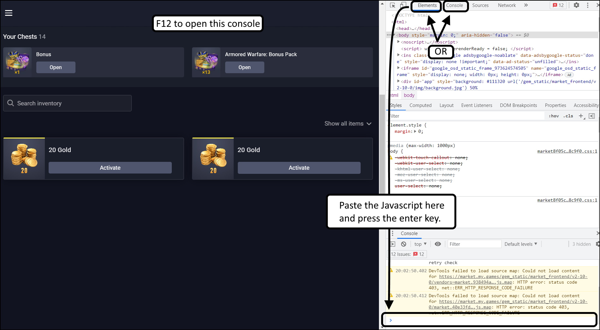

## Armored Warfare Utilities

### Activate Gold
[Javascript For Mass-Activating Gold](/web-utilities/gold-activate.js)
1. Use a web browser on a computer.
2. Open the My.Games Market Inventory tab in the browser.
3. Open the developer console of the browser in that page.  Pressing the F12 key is a common way to do this.
4. Copy the javascript above and do one of these:  
   - Go to the "Elements" tab, there is a console in the bottom with a cursor ">".
   - Go to the "Console" tab, and find the cursor ">".
5. Paste the javascript where that cursor is and press enter.
6. The total gold activated will be listed in the console and then the gold will be activated.

